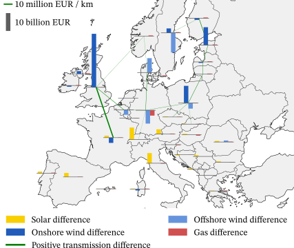
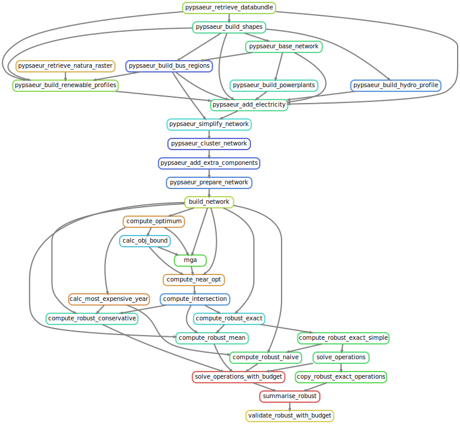

<!--
SPDX-FileCopyrightText: 2022 Koen van Greevenbroek & Aleksander Grochowicz

SPDX-License-Identifier: CC-BY-4.0
-->

# Introduction

This repository contains the implementation of the methods presented in the paper [Intersecting near-optimal spaces: European power systems with more resilience to weather variability](https://arxiv.org/abs/2206.12242) (preprint).

We incorporate several decades of weather data into [PyPSA-Eur](https://github.com/PyPSA/pypsa-eur) and compute solutions robust against weather variability using intersections of near-optimal spaces.
The repository also builds on [load and hydro data](https://github.com/aleks-g/multidecade-data) representing the weather variability of the years 1980-2020.

For each weather year, we approximate (a projection of) the near-optimal feasible space of the linear problem defined by PyPSA-Eur, by solving the model multiple times with different objectives.
We then intersect these near-optimal spaces to obtain solutions that are near-optimal and feasible for each year, making them robust.
Inside the intersection (if it exists), we find a central solution which is designed to be resilient to perturbations.

Our methods are introduced and explained in more detail in the [paper](https://arxiv.org/abs/2206.12242), and the implementation and data sources are elaborated on further down in this README.

The approach can be extended to other uncertainties beyond weather and can thus generate allocations that show stability under different scenarios.

<p align="center">
    
</p>

The above map shows the differences in investment between a robust and an optimal network computed with 41 weather years.


# Installation and usage

The model is built using a snakemake workflow, and [PyPSA-Eur](https://github.com/PyPSA/pypsa-eur) and [PyPSA-Eur-Sec](https://github.com/PyPSA/pypsa-eur-sec) are included as git submodules and snakemake modules.

1. Clone the git repository, making sure to also bring in the pypsa-eur and pypsa-eur-sec submodules with `--recurse-submodules`:

   ```sh
   git clone --recurse-submodules git@github.com:aleks-g/intersecting-near-opt-spaces@sector-coupling.git
   ```

2. Install a patched version of snakemake which deals properly with nested modules. First install conda or [mamba](https://mamba.readthedocs.io/en/latest/installation.html), then build a conda environment containing the correct version of snakemake:

   ```sh
   mamba env create -f workflow/envs/snakemake.yaml
   ```

   Now activate the environment with `conda activate snakemake_patched`.

3. Place ERA5 cutouts produced by atlite in the `workflow/modules/pypsa-eur/cutouts` directory, following the naming scheme `europe-era5_{year}`. 

4. Execute the full default sector-coupled model by running:

   ```sh
   snakemake --configfile config/config-default-sec.yaml --use-conda -j all -- compute_all_robust
   ```

   Other aggregate rules making use of the parameters in the `scenario` section of the configuration file include `compute_all_optimum`, `compute_all_near_opt`, `compute_all_intersections`, and `validate_all`. Alternatively, it is always possible to compute specific results by referring to their filenames directly, such as:

   ```sh
   snakemake --configfile config/config-default.yaml --use-conda -j all -- "results/default/robust/exact_1980-1990_100_50_lcopt_Co2L-3H.nc"
   ```
   
   Before starting running a big task, it's a good idea to check how snakemake plans to execute the various rules by running snakemake with the `-n` (`--dry-run`) argument.

   In order to use a different configuration file (such as the `v1.0` configuration used for publication results), run snakemake with `--configfile config/config-v1.0.yaml` instead.


## Prepared network files

In case obtaining all ERA5 data is difficult due to the space requirements (the full set of cutouts taking about 330GB), we have made prepared network files available for the `v1.0` configuration at [https://doi.org/10.5281/zenodo.6683829](https://doi.org/10.5281/zenodo.6683829).
Create the directory `networks/v1.0` and place the network files in it.
This allows the rest of the workflow to be run as normal.


# Executive description of approach

We attempt to use workflows from PyPSA-Eur as much as possible, also trying to follow their practices. 
Except for the changes in data that are needed for our approach (e.g. hydro generation, load data) we use assumptions that are close to the ones used in PyPSA-Eur. 
We strive to document all the functions that we introduce or where we deviate from PyPSA-Eur.

After the PyPSA-Eur rules create the necessary network files, we run a cost optimisation with the `compute_optimum` rule which is analogous to finishing a normal PyPSA-Eur run with `solve_network`. 
The objective value (total system costs) is necessary to define the near-optimal constraint in costs (the `eps` slack) and this cost-minimal design can later be compared with other near-optimal or robust alternatives:
a *near-optimal* solution by definition is one whose costs are not higher than (1 + eps) times the optimal costs.

At the core of the present workflow is an algorithm to approximate the space of near-optimal solutions of PyPSA-Eur networks.
Or rather, since this space is too high-dimensional to describe well, we approximate a lower-dimensional projection of the near-optimal space.
In our case, we reduce down to only a few configurable dimensions, lowering the complexity but losing some information in the process.
The approximation of the low-dimensional near-optimal space, which is a convex polytope, is based on solving the associated network with different objectives in order to find vertices of the polytope.

As an efficient way of exploring the geometry of this polytope --- in particular its range along every axis --- we begin with optimisations along each cardinal direction (positive and negative) in the `mga` rule.
If the values of these optimisations are not ill-behaved, this gives us a first approximation of the near-optimal polytope.

To get a finer approximation, we now investigate more directions in the `compute_near_opt` rule.
We first rescale the first polytope approximation such that the width in each cardinal direction is 1; this is so each dimension is explored evenly.
Then, the network is optimised in different directions and the resulting vertices added to the approximate polytope.
We implement a few different methods for generating directions (see the configuration file): either randomly or based in various ways on facets of the current approximation at each step.
Directions are filtered such that no two directions with a given angle threshold are explored; this threshold is decreased automatically if no more directions can be found.

This algorithm ends
- if we have found the entire near-optimal feasible space (in practice, we run out of directions; consider changing `angle_tolerance`),
- if our convergence criterion (defined in the configuration file) is satisfied, depending on volume or Chebyshev radius,
- if we have reached the maximal number of iterations (defined in the configuration file).

At this point, we have found an approximate geometric description of the near-optimal feasible space.
Now we repeat the process for a number of different models, and intersect them.
In our case, we compute the intersection of the near-optimal spaces associated with models defined over each of the weather years 1980-2020.
This allows us to compute a robust solution based on the shape of the intersection: we take the Chebyshev centre of the intersection.
That is, it is the centre point of the ball of maximal radius that is fully contained within the intersection. 
Or put differently, it is the allocation which can be altered maximally in any direction and is still both near-optimal and feasible for each weather year.
This is just one of many possible robust solutions in the intersection.

As the Chebyshev centre is given in the reduced, lower-dimensional space, another procedure is needed to construct from this robust solution a fully resolved network.
The simplest but most computationally intensive method is to solve the network (with all weather years) with fixed total investments / capacities given by the Chebyshev centre (the `compute_robust_exact` rule).
We also give two alternative heuristic allocations (`compute_robust_conservative` and `compute_robust_mean`).


# Implementation and structure

## Organisation

We allow the use of multiple different configuration files, whose associated workflows and results are isolated from each either; for each snakemake invocation a configuration file must be chosen using the `--configfile` argument.
Among others, a configuration file specifies (in the `projection` section) how to aggregate variables in order to map down to a few dimensions.

We create a separate instance of a PyPSA-Eur workflow for each configuration in `workflow/modules/pypsa-eur-{config-name}`, which are stripped-down copies of `workflow/modules/pypsa-eur-base` (itself a git submodule based on a [fork of PyPSA-Eur](https://github.com/koen-vg/pypsa-eur/tree/maa-v1)).

Completed PyPSA-Eur networks which are ready for further processing are placed in `networks/{config-name}`.
Results are placed in `results/{config-name}`, and organised by rule.
For example, `results/{config-name}` includes the subdirectories `optimum`, `near_opt`, `robust` and `operationst`.

## PyPSA-Eur

We use a slightly modified version of [PyPSA-Eur](https://github.com/PyPSA/pypsa-eur) as the base of our model.
PyPSA-Eur is an energy systems optimisation model for the European electricity sector, itself built on the [PyPSA](https://github.com/PyPSA/pypsa) (Python for Power System Analysis) framework.
We refer to the [documentation of PyPSA](https://pypsa.readthedocs.io/en/latest/) and [documentation of PyPSA-Eur](https://pypsa-eur.readthedocs.io/en/latest/) for more details.

Our modifications to PyPSA-Eur mostly involve the capability to work with multiple weather years.
To this end, we introduced a new `{year}` wildcard.
This wildcard represents either a single year or a set of years, specifying which period the network is defined over.
The input data has also been extended to support this use-case, with our model taking advantage of ERA5 reanalysis weather data for 1980-2020 in order to compute capacity factors for renewables and to synthesise load data.
See the Data section further down for more details.

Most PyPSA-Eur functionality is supported. 
In particular, the `config["pypsa-eur"]` section of config files may contain valid PyPSA-Eur configuration, and can be used to configure the model you want to work with (including selection of countries, technologies, etc.). 
Any configuration not specified in `config["pypsa-eur"]` is set to its default value as specified in the PyPSA-Eur `config.default.yaml`-file. 
Note that the `renewable.*.cutout` configuration is changed to reflect how we source decades of ERA5 weather data.

A few PyPSA-Eur features are not supported. These include:
- Multiple investment periods,
- The `BAU`, `SAFE`, `CCL` and `EQ` options (in the `{opts}` wildcard),
- Battery and hydrogen `stores`, as opposed to `storage_units`.
- The `clip_p_max_pu`, `load_shedding`, `noisy_costs` and `nhours` options the `solving.options` configuration section.
- Iterative solving using the `ilopf` function.
Most of these limitations are a result of the fact that the present workflow mostly solves networks directly using `pypsa.linopf.network_lopf` instead of using all the functionality in the PyPSA-Eur `solve_network` script, and may be lifted in the future.


## Near-optimal spaces

We structure our implementation as a snakemake workflow with PyPSA-Eur as a snakemake submodule.
This image represents the workflow (note the pypsaeur prefixes for PyPSA-Eur-borrowed rules):


A summary of the most important rules follows:

1. The rule `compute_optimum` is analogous to `solve_network` in PyPSA-Eur. It solves the energy system with the given configuration such that the total system costs are minimised.

2. The rule `mga` is the first step used to explore the geometry of a near-optimal feasible space in cardinal direction. Allowing a total system cost increase within some chosen `eps` slack, it minimises and maximises the decision variables defined in the configuration file.

3. The rule `compute_near_opt` computes an approximation of the near-optimal space of the given network. It does so by solving the network repeatedly with different objectives in order to find extreme points of the near-optimal space.

4. The rule `compute_intersection` computes the intersection of the given near-optimal feasible spaces from step 3. Additionally, it computes the Chebyshev centre of the intersection.

5. The rules `compute_robust_*` compute fully resolved robust networks based on the results from 4. That is, they compute networks satisfying the total robust investments given by the Chebyshev centre. While `compute_robust_exact` does this exactly, it requires an optimisation with all weather years. The two heuristic alternative are `compute_robust_conservative` and `compute_robust_mean`.

6. The rule `solve_operations` takes a network and optimises its dispatch. For the robust networks, this is done over all weather years. We allow load shedding in case demand cannot be met to make the model feasible. The dispatch optimisation is done year-by-year when the `-single-years` wildcard is used to avoid heavy computational toll. Alternatively (`solve_operations_with_budget`), it is possible to an use an operational budget, for instance given by the variable costs used in the "exact" allocation. If single-year snapshots are used for this, then the budget for variable costs is divided in equal parts onto each weather year.

7. The aggregation rules `validate_robust` and `validate_robust_with_budget` summarises the results of validating all robust networks specified in the configuration.


## Other considerations

As with PyPSA-Eur, be cautious about changing configuration relating to model building and near-optimal space projection after running parts or all of the workflow; this may introduce inconsistencies in the data which are not detected or corrected automatically.
To be on the safe size, one can remove the networks and results relating to a particular configuration manually (they are located in `results/{config-name}`, `networks/{config-name}` and `workflow/modules/pypsa-eur-{config-name}`).
Alternatively, on can create a new configuration file with a different name which will start a new workflow from scratch.

As the `compute_near_opt` rule may take a long time, the results from each iteration are cached.
Thus, if this rule is interrupted for any reason, restarting it will cause it start where it left off before being interrupted, using the data in `cache/{config-name}` (and `debug/{config-name}`.
The cached partial results are stored together with a hash of the relevant parts of the associated configuration file so that the cached results can be discarded if relevant configuration changed.
Thus, the user should never have to delete cached results manually.


# Computational requirements

There are many factors coming into play here, so all of the following is just the performance on our machines (desktops with 16GB RAM or more) or larger clusters.

The `default` configuration with 181/90 nodes with a temporal resolution of 3H over an entire year takes approximately an hour to solve (depending on the objective direction in MGA/near-optimal runs this can vary quite a bit) and requires approximately 10 GB of memory. `small-default` in turn (35 nodes) needs 10-20 minutes to solve with approximately 3 GB RAM.

Computing an exact robust solution with 35 nodes over all 41 years with a three-hourly resolution requires approximately 135 GB RAM and 30-45 hours to solve. 
The heuristic allocations (`conservative` and `mean`) take significantly less computational power (1 and 41 single-year optimisations respectively).
Optimising dispatch over 41 years (`solve_operations`) takes approximately 135 GB RAM and 5-12 hours to solve with the `small-default` configuration.
Splitting up the dispatch optimisation into single year reduces the resource requirements significantly.

Depending on the resources available, parallelising the iterations in the `compute_near_opt` rule (via `num_parallel_solvers` in the configuration files) can significantly increase the speed of the workflow. 


# Configuration

Our standard configuration is called [`default`](config/config-default.yaml) and is well-documented.
For the PyPSA-Eur section of the configuration, we refer to the relevant [PyPSA-Eur configuration documentation](https://pypsa-eur.readthedocs.io/en/latest/configuration.html). 

The configuration used to produce the results accompanying the first release of this workflow is [`v1.0`](config/config-v1.0.yaml).

A configuration file needs to have a name (corresponding to the file name of the form config-{name}.yaml) and furthermore the following:

- a "near_opt_approx" section with values for `directions`, `directions_angle_separation`, `num_parallel_solvers`, `iterations`, `conv_method`, `conv_epsilon` and `conv_iterations`;
- a "projection" section specifying variables and coefficients to aggregate to each dimension of the reduced near-optimal space.
- a "pypsa-eur" section which updates changes in the default pypsa-eur config (including the choice of countries, at which date to start a weather year, the CO_2 limit, the extendable and conventional carriers to be used, as well as options on atlite, the solver and load data).
- Optionally a "scenario" section with values for `year`, `simpl`, `clusters`, `ll`, `opts`, `eps`, `method` and `operation_method`, in order to use the variation `*_all_*` snakemake rules.


# Data

We are using data from the same sources that PyPSA-Eur does, however with some slight variations.

## Cost data

We use cost data as in the PyPSA-Eur, see [here](https://pypsa-eur.readthedocs.io/en/latest/costs.html); these are assumptions for 2030.

## Weather and renewable resource data

We are using reanalysis data from ERA5 for the time period between 1980 and 2020, which covers the studied region in an hourly resolution. This is processed by atlite to generate capacity factor time series for solar PV, on- and offshore wind.
Although the ERA5 data may be retrieved through the Copernicus API using Atlite, this takes a long time.
Therefore we have also make the cutouts available at [DOI: 10.11582/2022.00034](https://www.doi.org/10.11582/2022.00034).
By default these cutouts are downloaded automatically (only for the required set of years), but this can be controlled using the `config.pypsa-eur.enable.retrieve_cutout` configuration option.

Preparing hydropower and load data for 1980-2020 required additional processing; the required code and documentation to reproduce these data can be found at [https://github.com/aleks-g/multidecade-data/tree/v1.0](https://github.com/aleks-g/multidecade-data/tree/v1.0).
The resulting hydro- and load data have been included in the [PyPSA-Eur version](https://github.com/koen-vg/pypsa-eur/tree/maa-v1) used for the present workflow.


### Hydropower data

For hydropower we are following the approach in PyPSA-Eur where we use ERA5 reanalysis data to generate inflow profiles that are being scaled by historical hydro generation data from EIA.
We have extended the default dataset in PyPSA-Eur to cover the entire period of 1980 to 2020, and we have also normalised the EIA's production data to EIA's capacity levels of 2020.
This allows a comparison throughout different years without any trends in infrastructure development.
To avoid anachronisms, we have distributed generation and capacities of no longer existing countries onto the current states (based on the first year of the current form, e.g.
1993 for Czechia and Slovakia).

## Load data

We have created an artificial electricity demand dataset through an regression on ENTSO-E load data and temperature influence on it (per country).
Based on training data from 2010 to 2014 (with temperature data from ERA5 reanalysis and actual ENTSO-E load data per country), we have validated a regression into temperature-dependent and -independent load for 2015.
The parameters we obtained from this regression we use to generate artifical load data for all years (1980-2020) such that they are all comparable (similar to the generation data).

For all runs studied, we have increased the load for each hour by 13% based on estimations from the European commission that the load by 2030 in Europe will increase by this percentage.
[The Climate Target Plan](https://ec.europa.eu/clima/eu-action/european-green-deal/2030-climate-target-plan_en) has the following [data](https://ec.europa.eu/clima/document/download/ec1acac9-10fe-4eeb-915f-cad388990e0f_en) supporting this:


